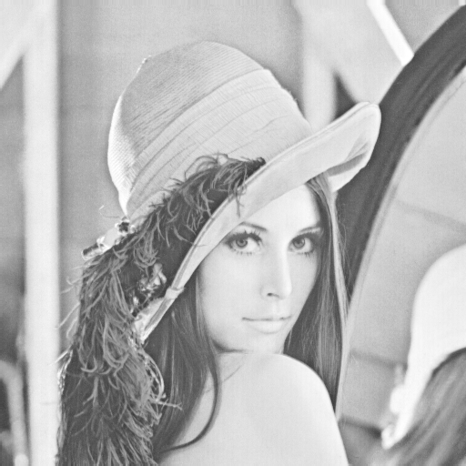
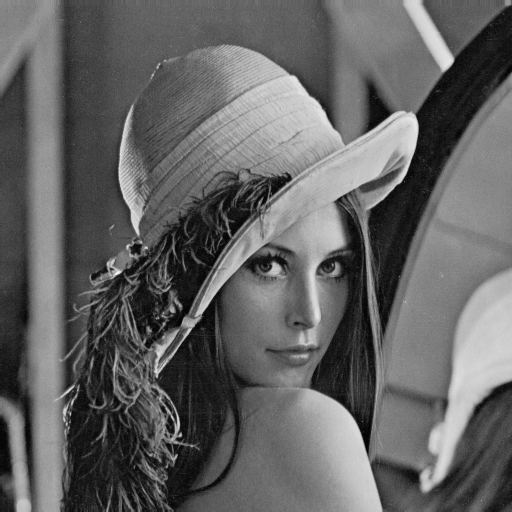
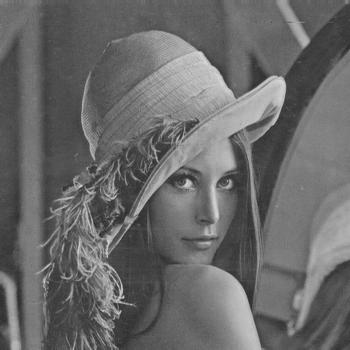
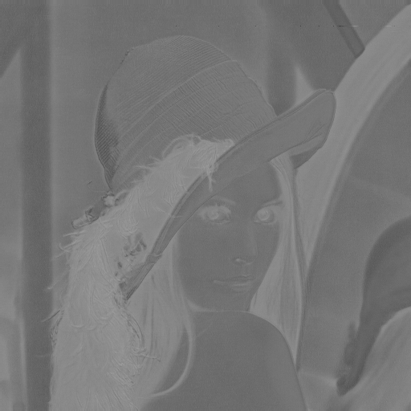
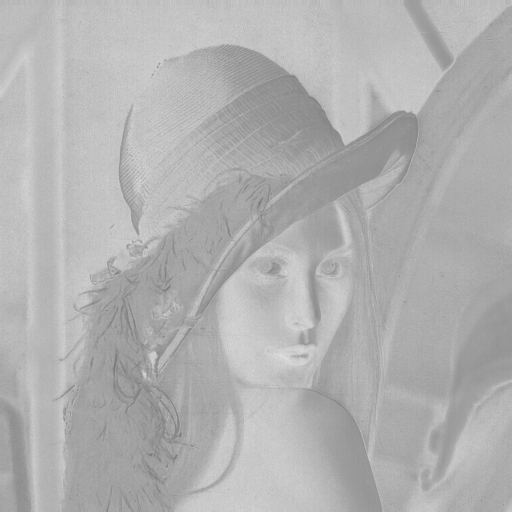
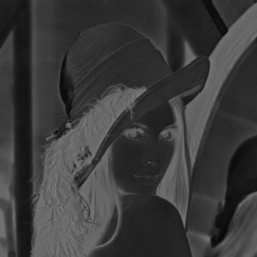
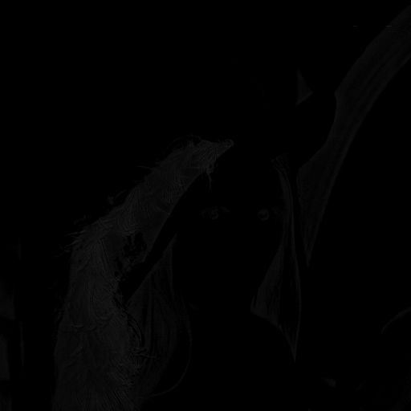
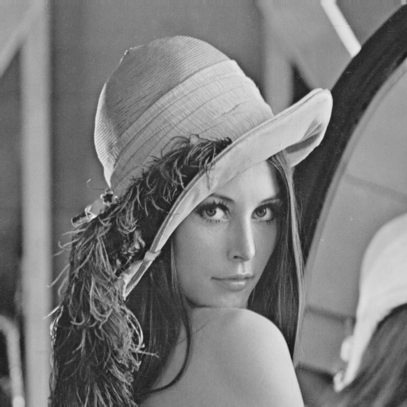

## Homework 1 – Color Transform

| Student ID | Name |
|-----------|-----------|
| 313553014 | Yi-Cheng Liao |


### Introduction

Digital images are usually represented in the **RGB (Red, Green, Blue)** color space, which is suitable for display devices but not always ideal for processing tasks such as compression and enhancement. RGB mixes brightness and color information, making it less efficient for certain operations.

To address this, other color spaces like **YUV** and **YCbCr** are commonly used.

* **YUV** separates an image into **Y** (luminance) and **U, V** (chrominance), which aligns with human vision sensitivity and is useful for compression.
* **YCbCr**, widely used in JPEG and video compression standards, also separates luminance (**Y**) and chrominance (**Cb, Cr**) with slightly different formulas.

In this assignment, I take a given image (`lena.png`) and implement manual transformations to convert it from the RGB color space to both YUV and YCbCr, strictly following the provided formulas. By separating the channels, we can visualize and analyze each component individually, gaining a deeper understanding of how different color spaces represent image data.

The task involves generating eight grayscale images corresponding to the individual channels: **R, G, B, Y, U, V, Cb, and Cr**. This step-by-step process provides hands-on experience with fundamental concepts in image processing, which are essential for advanced topics such as compression, denoising, and computer vision.

### Environments

```
# python 3.10
pip install -r requirements.txt
```

### How to run my code?

```
python main.py
```

### Results

| R Channel | G Channel | B Channel |
|-----------|-----------|-----------|
|  |  |  |

| Y Channel | U Channel | V Channel |
|-----------|-----------|-----------|
|  |  |  |

| Cb Channel | Cr Channel |
|------------|------------|
|  |  |


### Disccusion

This discussion compares the visual results of three different YUV conversion methods.
The goal is to observe how the **U** and **V** chrominance channels behave under different formulas, while the **Y** luminance channel remains consistent.

Below are the visual results of the three methods for the **U**, **V**, and **Y** channels:

| **Slide + Offset** | **Slide (No Offset)** | **Homework Formula** |
|--------------------|-----------------------|----------------------|
|  |  |  |
| **U Channel** | **U Channel** | **U Channel** |
|  |  |  |
| **V Channel** | **V Channel** | **V Channel** |
|  |  |  |
| **Y Channel** | **Y Channel** | **Y Channel** |


The three methods show clear differences in the U and V channels while the Y channel remains the same across all approaches.


| Method               | U/V Visualization               | Extra Processing Needed | Practical Use          | Notes                                     |
| -------------------- | ------------------------------- | ----------------------- | ---------------------- | ----------------------------------------- |
| **Slide formula**    | ✗ Almost black, clipped values | +128 shift required     | Theoretical only       | Values can be negative or >255            |
| **Slide + offset**   | ✓ Clear details                | Manual offset needed    | Display-ready          | Shifts U/V to [0,255]                     |
| **Homework formula** | ✓ Clear details                | None                    | Real-world (JPEG/MPEG) | Built-in offset and adjusted coefficients |

### **Summary**

- The **slide formula** is good for theory but unsuitable for direct visualization since U/V values are centered around 0.
- Adding **+128 offset** makes the chrominance channels displayable.
- The **homework formula** integrates this offset and slightly adjusts coefficients, matching practical image and video compression standards.
